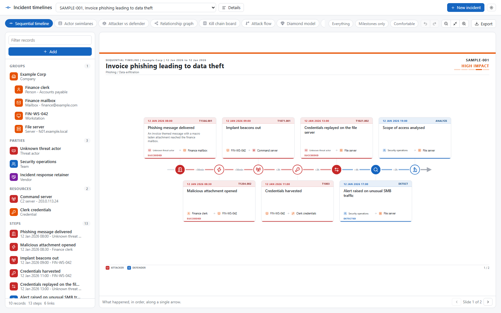
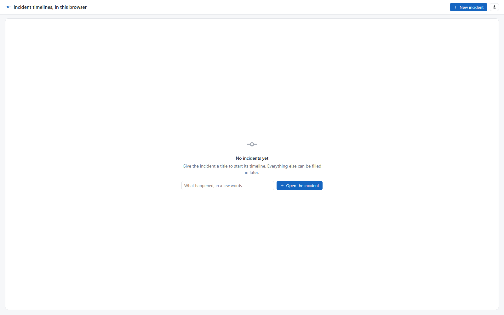
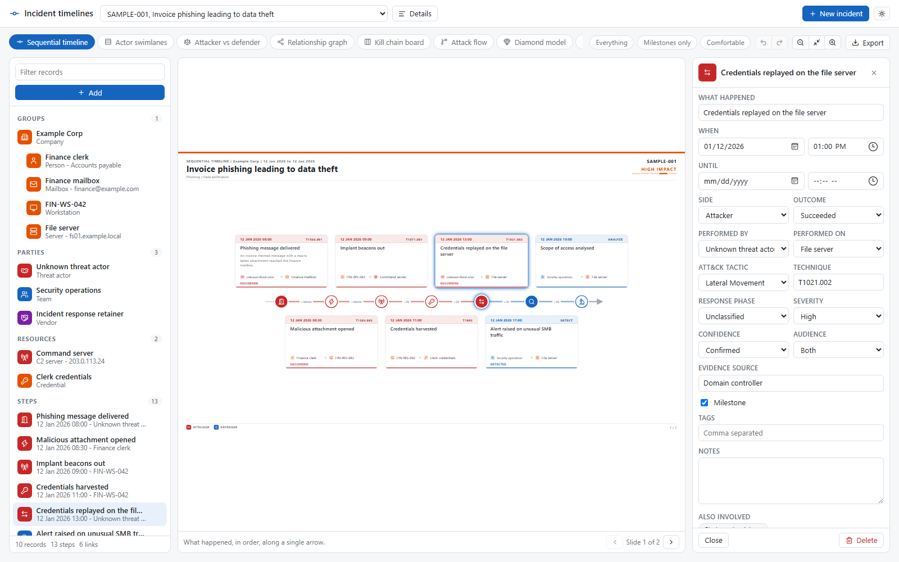
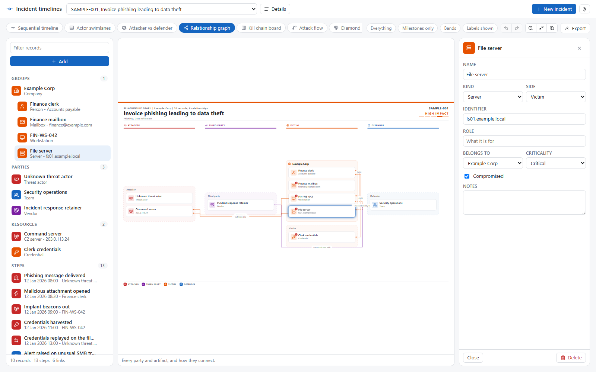
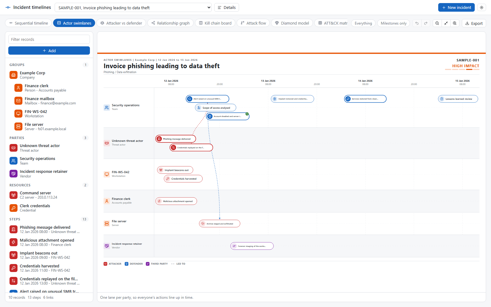
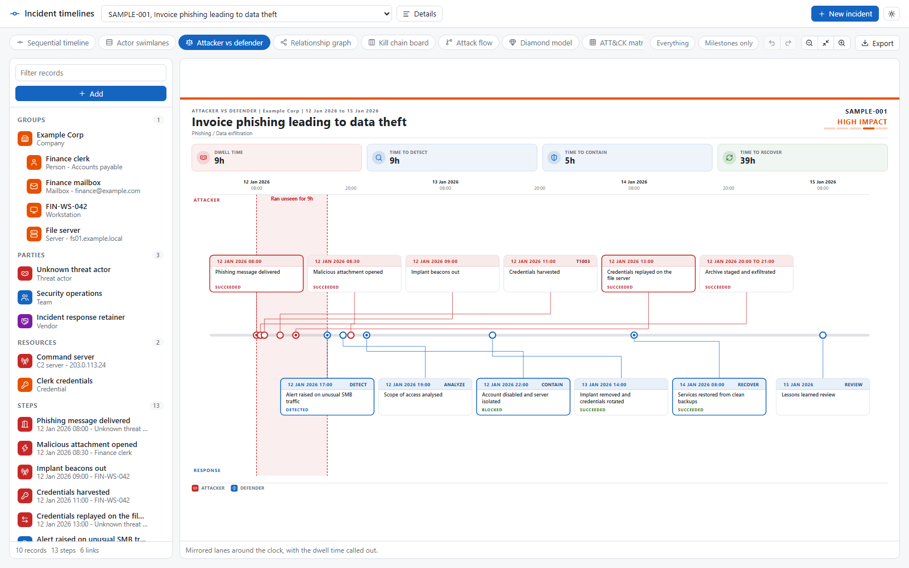
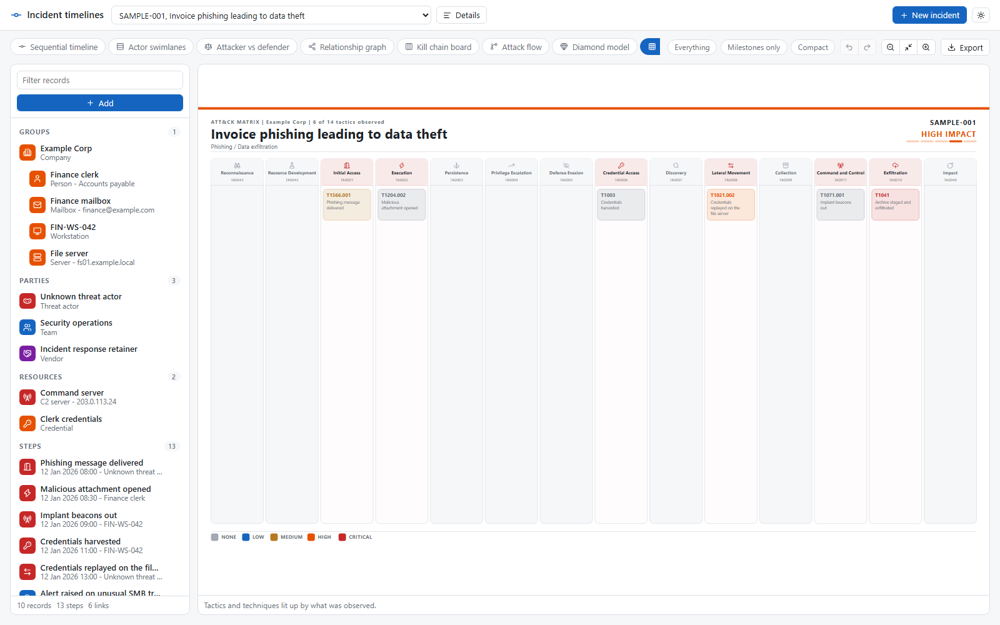
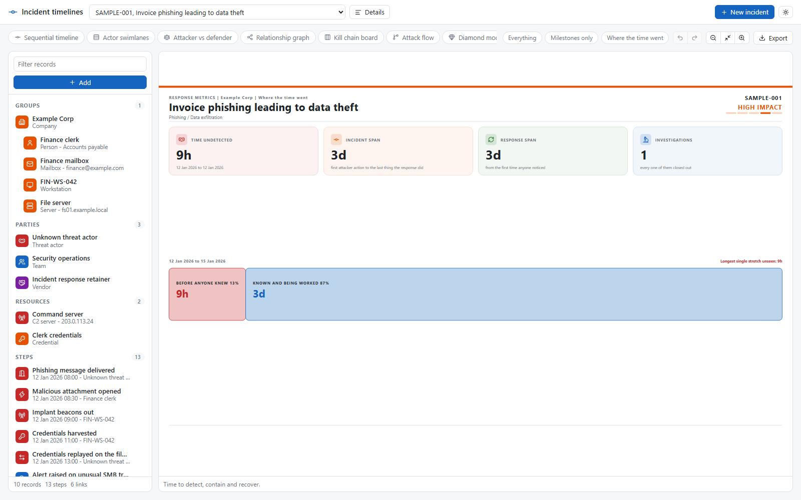
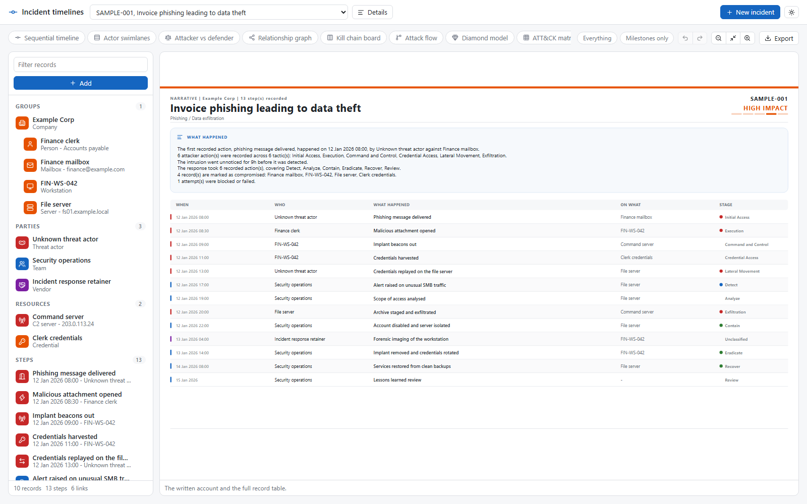
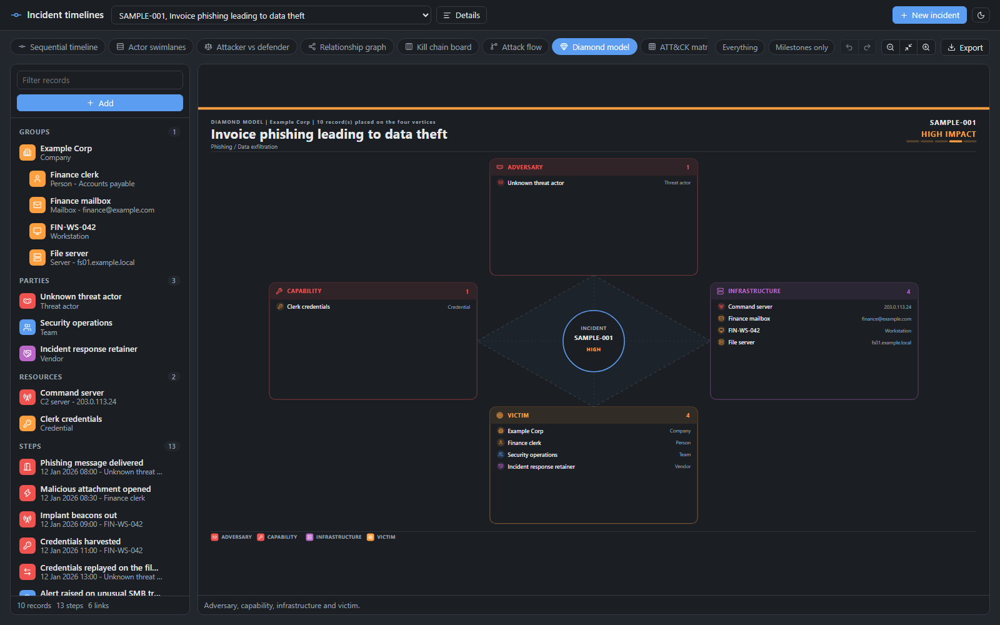

# Installing and using cyber-incidents-timeline-generator

This guide takes you from nothing to a working incident timeline, either as a ready incident desk or inside your
own project. It covers trying the tool in two minutes, a tour of the workspace, the ways of deploying it,
configuration, and the problems people usually run into. Connecting it to an incident handling tool you already
use is covered in [CONNECTORS.md](CONNECTORS.md).



## Contents

1. [Requirements](#1-requirements)
2. [Try it in two minutes](#2-try-it-in-two-minutes)
3. [A tour of the workspace](#3-a-tour-of-the-workspace)
4. [Choosing how to run it](#4-choosing-how-to-run-it)
5. [In the browser only](#5-in-the-browser-only)
6. [With the reference server](#6-with-the-reference-server)
7. [Inside an existing Node application](#7-inside-an-existing-node-application)
8. [With a backend in another language](#8-with-a-backend-in-another-language)
9. [Choosing where the data lives](#9-choosing-where-the-data-lives)
10. [Feeding incidents from code](#10-feeding-incidents-from-code)
11. [Theming and customisation](#11-theming-and-customisation)
12. [Configuration reference](#12-configuration-reference)
13. [Troubleshooting](#13-troubleshooting)

## 1. Requirements

| To | You need |
|---|---|
| Show the workspace | Any current browser: Chrome, Edge, Firefox or Safari |
| Run the reference server or use `/server` | Node.js 22.13 or later, which ships the SQLite driver used here |
| Use the types from TypeScript | TypeScript 5 or later; `@types/node` only if you import `/server` |

The package has no runtime dependencies. Nothing else gets installed with it.

## 2. Try it in two minutes

```bash
npx cyber-incidents-timeline-generator --seed
```

```
Seeded "Invoice phishing leading to data theft" as incident 5.
Timeline generator listening on http://127.0.0.1:8080
REST API under http://127.0.0.1:8080/api
Incident app at http://127.0.0.1:8080/, or http://127.0.0.1:8080/local.html to keep incidents in the browser only
```

Open `http://127.0.0.1:8080/`. That is the whole incident desk: pick an incident at the top, open a new one,
edit its details or delete it, and build its timeline below. Incidents are stored in `timeline.sqlite`, created
in the folder you ran the command from, and the address carries the open incident so it can be bookmarked.

`/local.html` is the same desk with no server behind it: incidents stay in the local storage of the browser and
no request leaves the page. Add `?sample` to its address to start with the sample incident.

`--seed` adds a sample phishing incident, plus four earlier incidents so the benchmark view has history to
compare against. Without it the desk opens empty and asks for a title, which is all a new incident needs:



Stop the server with Ctrl+C. Run it again without `--seed` and your data is still there.

Working from a clone of the repository instead, `npm install` then `npm start` does the same thing.

## 3. A tour of the workspace



The desk is built from five areas.

- **The app bar** at the very top: the incident picker, **Details** to edit or delete the open incident,
  **New incident**, and the theme toggle, which switches the whole page.
- **The toolbar** under it. On the left, one pill per representation. On the right, the filters, undo
  and redo, zoom, the theme toggle and the export menu.
- **The record list** on the left. Groups (a company and what it holds), parties, resources, steps and
  relationships. The search box filters it. **Add** opens a menu: pick a kind, type a name, press Enter, and the
  next empty line is already waiting.
- **The slide** in the middle. Every representation is drawn as 1600 by 900 slides, so what you see is what
  you export. Drag to pan, Ctrl and the mouse wheel to zoom, the arrows at the bottom to change slide.
- **The details panel** on the right, open while something is selected. Click a record, a step or a
  relationship, on the slide or in the list. Every field saves as soon as you leave it, and Ctrl+Z undoes it.
  Escape or a click on empty space closes the panel.

The filters reshape every view at once: **Everything / Executive / Technical** keeps the steps written for
that audience, and **Milestones only** keeps the few steps that carry the story. Some views add their own
setting next to them, such as the density of the sequential timeline or the layout of the relationship graph.

### The representations

| | |
|---|---|
|  **Relationship graph.** Who and what was involved, grouped by side and by owner. Records can be dragged; the position is kept. |  **Actor swimlanes.** One lane per party, lined up in time, with arrows where one party's action led to another's. |
|  **Attacker vs defender.** The intrusion above the clock, the response below, and the time the intruder went unseen. |  **ATT&CK matrix.** The tactics and techniques observed, coloured by severity. |
|  **Response metrics.** Where the time went, and how it compares with targets or with earlier incidents. |  **Narrative.** A generated written account and the full list of steps, for the appendix. |

The sequential timeline, kill chain board, attack flow, diamond model, blast radius and evidence timeline
complete the set.

### Dark mode and export



The sun or moon button cycles between following the system, light and dark, for the whole page. The choice is
remembered in the browser. Embedded in your own site, the workspace follows the theme your site declares instead,
see [Theme](#theme). **Export** produces PNG or SVG files (one per slide), a single self-contained HTML
deck that opens anywhere, or sends every slide to the print dialog, which is how you get a PDF.

## 4. Choosing how to run it

| Your situation | Go to | What stores the data |
|---|---|---|
| A simple incident desk, nothing to integrate | [Reference server](#6-with-the-reference-server), as it comes | A SQLite file |
| Incidents already live in a ticketing tool, SOAR or case manager | [CONNECTORS.md](CONNECTORS.md) | The tool, plus a store for the timelines |
| A personal tool, a workshop, a static intranet page | [Browser only](#5-in-the-browser-only) | The browser's local storage |
| A small team wanting a shared tool quickly | [Reference server](#6-with-the-reference-server) | A SQLite file |
| You already run a Node application with its own users | [Existing Node application](#7-inside-an-existing-node-application) | SQLite, PostgreSQL or your own store |
| Your backend is .NET, Java, Python, Go or anything else | [Another language](#8-with-a-backend-in-another-language) | Your database, behind your API |

In every case the browser part is the same `mountTimelineApp` call for a full page desk, or `mountTimeline` for
the workspace of one incident inside your own screens. Only the `api` you give them changes.

## 5. In the browser only

Install the package, then serve the folder with any static file server.

```bash
npm install cyber-incidents-timeline-generator
```

```
my-timeline/
  index.html
  app.js
  node_modules/cyber-incidents-timeline-generator/
```

`index.html`:

```html
<!doctype html>
<html lang="en">
<head>
    <meta charset="utf-8">
    <title>Incident timeline</title>
    <link rel="stylesheet" href="node_modules/cyber-incidents-timeline-generator/styles/timeline.css">
</head>
<body>
    <div id="timeline" style="--tlg-height: 90vh"></div>
    <script type="module" src="app.js"></script>
</body>
</html>
```

`app.js`:

```js
import {
    BrowserStorageTimelineStore,
    TimelineService,
    mountTimeline
} from "./node_modules/cyber-incidents-timeline-generator/dist/index.js";

const api = new TimelineService(new BrowserStorageTimelineStore(window.localStorage, "my-timeline"));

const [existing] = await api.listIncidents();
const incident = existing ?? await api.createIncident({ title: "Suspicious sign-in on the VPN" });

await mountTimeline(document.getElementById("timeline"), { api, incidentId: incident.id });
```

```bash
npx serve .
```

Pages using ES modules must be served over HTTP. Opening `index.html` straight from the disk does not work.

### Hosting the ready desk on a static host

The browser only desk needs no code of your own. From a clone of the repository:

```bash
npm ci
npm run site
```

`site/` then holds `index.html`, its scripts, `dist/` and `styles/`, all with relative paths, so it can be served from
any folder of any static host: GitHub Pages, GitLab Pages, an S3 bucket, an intranet web server. Every visitor keeps
their own incidents in their own browser, and add `?sample` to the address to start with the sample incident.

This repository publishes it to GitHub Pages with `.github/workflows/pages.yml` on every push to `master`. In a fork,
enable it once under **Settings > Pages** by choosing **GitHub Actions** as the source.

### With a bundler

With Vite, webpack, Rollup, esbuild or anything else that understands package exports, import by package name:

```js
import "cyber-incidents-timeline-generator/styles.css";
import { BrowserStorageTimelineStore, TimelineService, mountTimeline } from "cyber-incidents-timeline-generator";
```

### Moving data between browsers

Everything the browser store holds is one JSON snapshot, which you can save and load:

```js
const store = new BrowserStorageTimelineStore(window.localStorage, "my-timeline");
const backup = JSON.stringify(store.snapshot());
```

Restoring is a matter of writing that JSON back under the same key before the page creates the store.

## 6. With the reference server

The package includes a small HTTP server built on Node alone. It stores everything in SQLite, serves the REST API
and serves the incident desk at `/`. For a team that only needs a simple incident handling tool, this is the whole
deployment.

```bash
npm install cyber-incidents-timeline-generator
npx cyber-incidents-timeline-generator --db /var/lib/timeline/timeline.sqlite --port 8080
```

| Flag | Default | Meaning |
|---|---|---|
| `--db <file>` | `timeline.sqlite` | SQLite file, created when missing. `:memory:` keeps nothing |
| `--port <port>` | `8080` | Port to listen on |
| `--host <host>` | `127.0.0.1` | Interface to bind. The default only accepts connections from the same machine |
| `--api-only` | off | Serve the REST API alone, without the incident desk |
| `--seed` | off | Add the sample incident when the database is empty |

The reference server has **no authentication**. Keep it on `127.0.0.1` for yourself, or put it behind a reverse
proxy that authenticates users (nginx with SSO, oauth2-proxy, an identity aware proxy). To enforce who may do
what, use the handler inside your own application as shown in the next section, where `authorize` is available.

As a service on Linux, a systemd unit is enough:

```ini
[Service]
ExecStart=/usr/bin/npx cyber-incidents-timeline-generator --db /var/lib/timeline/timeline.sqlite --host 127.0.0.1
WorkingDirectory=/var/lib/timeline
Restart=on-failure
User=timeline
```

Back up the SQLite file like any other database: stop the service or use `sqlite3 timeline.sqlite ".backup copy.sqlite"`.

Your own page can use the server too, as a full desk or as the workspace of one incident:

```js
import { HttpTimelineApi, mountTimeline, mountTimelineApp } from "cyber-incidents-timeline-generator";

const api = new HttpTimelineApi({ baseUrl: "https://timeline.example.com/api" });

await mountTimelineApp(document.getElementById("desk"), { api, title: "CSIRT incidents" });
// or
await mountTimeline(document.getElementById("timeline"), { api, incidentId: 5 });
```

When the page and the API are on different origins, the proxy has to send the CORS headers; the server does not
enable cross origin requests itself.

## 7. Inside an existing Node application

`createTimelineHandler` answers the REST API from inside your server, so the timeline shares your users,
sessions and database. It resolves to `false` for any request that is not for it, so your own routing carries
on untouched.

### Express

```js
import express from "express";
import { createRequire } from "node:module";
import { dirname } from "node:path";
import { Permission, TimelineService } from "cyber-incidents-timeline-generator";
import { createTimelineHandler, openSqliteStore } from "cyber-incidents-timeline-generator/server";

const require = createRequire(import.meta.url);
const packageRoot = dirname(require.resolve("cyber-incidents-timeline-generator/package.json"));

const { store } = await openSqliteStore("data/timeline.sqlite", { tablePrefix: "tlg_" });

const timeline = createTimelineHandler({
    api: new TimelineService(store),
    basePath: "/api/timeline",
    authorize: (request, permission, incidentId) => {
        const user = request.user;
        if (!user) return false;
        if (permission === Permission.Read) return true;
        return user.roles.includes("incident-responder");
    },
    onError: error => logger.error(error)
});

const app = express();

app.use(yourSessionMiddleware);

// Register the timeline before any body parser: it reads the request body itself
app.use(async (request, response, next) => {
    try {
        if (!(await timeline(request, response))) next();
    } catch (error) {
        next(error);
    }
});

app.use(express.json());
app.use("/assets/timeline", express.static(packageRoot));
app.use(yourRoutes);
```

The page served by your application:

```html
<link rel="stylesheet" href="/assets/timeline/styles/timeline.css">
<div id="timeline" style="--tlg-height: calc(100vh - 120px)"></div>
<script type="module">
    import { HttpTimelineApi, mountTimeline } from "/assets/timeline/dist/index.js";

    const api = new HttpTimelineApi({
        baseUrl: "/api/timeline",
        headers: () => ({ "X-CSRF-Token": document.querySelector("meta[name=csrf-token]").content })
    });

    await mountTimeline(document.getElementById("timeline"), {
        api,
        incidentId: Number(new URLSearchParams(location.search).get("incident")),
        permissions: { canCreate: true, canEdit: true, canDelete: window.currentUser.isLead }
    });
</script>
```

`authorize` receives the Node request, one of `Permission.Read`, `Create`, `Update` or `Delete`, and the
incident concerned (`null` when listing incidents or reading the catalog). Returning `false` answers 403. This is
also where to check the CSRF token when your sessions use cookies. The `permissions` given to `mountTimeline`
only hide buttons: the server is what enforces them.

### Plain node:http, Fastify, Koa

The handler takes the standard Node request and response, so any framework giving access to them works:

```js
import { createServer } from "node:http";

createServer(async (request, response) => {
    if (await timeline(request, response)) return;
    await yourApplication(request, response);
}).listen(3000);
```

In Fastify, call it from an `onRequest` hook with `request.raw` and `reply.raw`, and call `reply.hijack()` when it
returns `true`. In Koa, call it with `ctx.req` and `ctx.res` and set `ctx.respond = false` when it returns `true`.

## 8. With a backend in another language

The workspace does not care what answers its requests. Implement the routes of
[docs/rest-api.md](docs/rest-api.md) in your stack and point `HttpTimelineApi` at them.

- Serve `dist/` and `styles/` from the package as static files, or copy them into your assets pipeline.
- `GET /catalog` returns the vocabulary. Run the reference server once and save its response, or build the
  same lists from your own enumerations.
- Keep the rules the Node service applies: validate every field, refuse references to records of another
  incident, remove a record's members and relationships with it, and remove the relationships a step created
  with the step. The contract document lists them.

If rewriting those rules is not worth it, run the reference server next to your application and let your
backend proxy `/api/timeline` to it after its own authentication.

## 9. Choosing where the data lives

| Store | Import from | Notes |
|---|---|---|
| `MemoryTimelineStore` | `cyber-incidents-timeline-generator` | Gone when the page or process ends. Tests and demos |
| `BrowserStorageTimelineStore` | `cyber-incidents-timeline-generator` | One browser, unencrypted, a few megabytes at most |
| `SqlTimelineStore` on SQLite | `cyber-incidents-timeline-generator/server` | `openSqliteStore(file)` creates the tables it needs |
| `SqlTimelineStore` on PostgreSQL and others | `cyber-incidents-timeline-generator/server` | Write a small driver, see [docs/storage.md](docs/storage.md) |
| `SourcedTimelineStore` | `cyber-incidents-timeline-generator` | Incidents from another tool, timelines in any store above. See [CONNECTORS.md](CONNECTORS.md) |
| Your own `TimelineStore` | `cyber-incidents-timeline-generator/core` | Any database or remote service |

Inside an existing database, `tablePrefix` keeps the timeline tables apart from yours:

```js
const { store } = await openSqliteStore("app.sqlite", { tablePrefix: "incident_timeline_" });
```

`schema/postgres.sql` in the package holds the PostgreSQL tables, ready for your migration tool.

## 10. Feeding incidents from code

Anything the workspace does is available from code, so incidents can be built from a SIEM export, a ticketing
system or a forensic report. The same calls work against `TimelineService` in process or `HttpTimelineApi`
against a server.

```js
import { AttackTactic, HttpTimelineApi, Impact, LinkKind, NodeKind, ResponsePhase, Side, StepOutcome } from "cyber-incidents-timeline-generator";

const api = new HttpTimelineApi({
    baseUrl: "https://timeline.example.com/api/timeline",
    headers: () => ({ Authorization: `Bearer ${process.env.TIMELINE_TOKEN}` })
});

const incident = await api.createIncident({
    title: "Ransomware on the build farm",
    referenceId: "INC-2026-0142",
    scope: "Engineering",
    impact: Impact.High,
    classifications: ["Ransomware"]
});

const actor = await api.createNode(incident.id, { name: "Unknown operator", kind: NodeKind.ThreatActor, side: Side.Attacker });
const host = await api.createNode(incident.id, { name: "build-07", kind: NodeKind.Server, side: Side.Victim, identifier: "10.4.2.17", compromised: true });
const soc = await api.createNode(incident.id, { name: "SOC", kind: NodeKind.Team, side: Side.Defender });

await api.createStep(incident.id, {
    title: "Encryption started on build-07",
    timestamp: "2026-03-02T02:14",
    side: Side.Attacker,
    attackTactic: AttackTactic.Impact,
    mitreTechniqueId: "T1486",
    outcome: StepOutcome.Succeeded,
    isMilestone: true,
    evidenceSource: "EDR",
    sourceNodeId: actor.id,
    targetNodeId: host.id
});

await api.createStep(incident.id, {
    title: "Host isolated from the network",
    timestamp: "2026-03-02T02:40",
    side: Side.Defender,
    responsePhase: ResponsePhase.Contain,
    outcome: StepOutcome.Blocked,
    sourceNodeId: soc.id,
    targetNodeId: host.id
});

await api.createLink(incident.id, { sourceNodeId: soc.id, targetNodeId: host.id, kind: LinkKind.Manages });
```

Incidents carry no dates of their own. Everything timed is a step, and the response figures come from the steps
of the defenders: the first with the `Detect`, `Contain`, `Eradicate` or `Recover` phase marks that point. Times are
the wall clock readings from your logs, without a zone: `2026-03-02T02:14` stays 02:14 whoever opens
the diagram. Each call is checked and applied as a whole: a payload that breaks a rule is refused with every
problem listed and changes nothing. An import made of many calls is not a single transaction, so check the
result of each call and delete the incident if the import has to be abandoned.

## 11. Theming and customisation

### Impact levels

Incidents, records and steps are rated on one impact scale. The default runs None, Low, Medium, High and
Critical, with Unknown for anything not rated yet. Replace it where the service is created:

```js
import { TimelineService } from "cyber-incidents-timeline-generator";

const api = new TimelineService(store, {
    impactScale: {
        unassessed: { level: "Unrated", label: "Not rated", color: "--tlg-impact-unknown" },
        levels: [
            { level: "P4", label: "Low", color: "#1565c0" },
            { level: "P3", label: "Moderate", color: "#b7791f" },
            { level: "P2", label: "High", color: "#e65100" },
            { level: "P1", label: "Critical", color: "#c62828" }
        ]
    }
});
```

- `levels` run from the least to the most severe. That order draws the scale in the slide header and decides
  which technique cell of the ATT&CK matrix counts as the most severe.
- `level` is the key stored in the database and sent over the API: 1 to 40 letters, digits, dashes or
  underscores, unique across the scale.
- `color` is any CSS colour, or the name of a custom property so your stylesheet decides it per theme.
- The service refuses any rating outside the scale, over HTTP as well, and the inspector only offers its levels.
- Ratings already stored under a key you later remove are kept and drawn in the muted colour; update them to
  a current level when you change scales.

The scale travels to the browser with the diagram, so nothing has to be configured on the page. A backend in
another language returns its own scale in `catalog.impactScale`.

### Slide header

Every slide starts with a title block. By default it shows the view and the scope above the incident title,
the classifications under it, and on the right the reference, the impact rating and its scale. Pass
`slideHeader` to change any of it. It receives the header the workspace would draw and returns the one to draw,
so you replace only what differs:

```js
await mountTimeline(element, {
    api,
    incidentId,
    slideHeader: (header, { incident, palette, page, pageCount }) => {
        const extra = ratingsFromYourSystem(incident.referenceId);
        return {
            ...header,
            subtitle: `Handled from ${extra.openedOn} to ${extra.closedOn}`,
            details: [
                { label: "BUSINESS", value: extra.business.toUpperCase(), color: palette.impactColor(extra.business) },
                { label: "FINANCIAL", value: extra.financial.toUpperCase(), color: palette.impactColor(extra.financial) },
                { label: "OWNER", value: extra.owner, color: null }
            ]
        };
    }
});
```

| Field | Default | Set it to |
|---|---|---|
| `accentColor` | colour of the impact rating | any CSS colour, or `null` for no rule across the top |
| `kicker` | view name, scope and what the view covers, separated by bars | any short line |
| `title` | the incident title | any text |
| `subtitle` | the classifications, or `null` | any text, or `null` to leave the line out |
| `reference` | the reference, or `#id` | any text, or `null` |
| `impact` | `{ level, label: "HIGH IMPACT", color, showScale: true }`, `null` when unrated | your own rating, or `null` |
| `details` | `[]` | small `{ label, value, color }` facts drawn on the right |

The context gives you the `incident`, the `store` (for lookups such as `store.impactLevel(key)`), the `palette`,
the `representation` being drawn, the `page` and `pageCount`, and `viewSubtitle`, which is what the view itself
says about the slide. The callback runs for every slide on screen and in every export, so keep it synchronous
and fetch any extra data before mounting.

### Colours

Every colour comes from a CSS custom property on the element you mount on. Override any of them in your own
stylesheet, and exports follow:

```css
#timeline {
    --tlg-accent: #0b5cad;
    --tlg-side-attacker: #b3261e;
    --tlg-side-defender: #0b5cad;
    --tlg-font: "Inter", system-ui, sans-serif;
    --tlg-height: 820px;
}

#timeline[data-tlg-theme="dark"] {
    --tlg-surface: #111418;
}
```

`styles/timeline.css` lists every token with its light and dark value.

### Theme

Light and dark belong to the whole site, not to one widget. In its automatic mode, the default, the workspace
reads the theme your page declares and follows it live, the moment the page switches. It recognises the usual
ways of declaring one, on `<html>` or `<body>`:

- `data-theme`, `data-bs-theme` (Bootstrap), `data-color-scheme` or `data-mode` set to `light` or `dark`
- a `dark` or `light` class
- a computed `color-scheme` of `light` or `dark`

When the page declares nothing, it follows the operating system. A site whose theme lives elsewhere passes its
own detector, and the workspace asks it again whenever the page or the system changes:

```js
import { ColorScheme, mountTimeline } from "cyber-incidents-timeline-generator";

await mountTimeline(element, {
    api,
    incidentId,
    themeToggle: false,
    themeDetector: () => yourThemeStore.isDark ? ColorScheme.Dark : ColorScheme.Light
});
```

With `themeToggle: false` the page is in charge: the workspace hides its toggle and ignores any choice a viewer
made with it earlier. `theme: ThemeMode.Light` or `ThemeMode.Dark` pins one theme whatever the page says, and
`handle.setTheme` changes it from code.

`mountTimelineApp` works the other way round, because it is the page: its toggle sets `data-theme` on `<html>`,
so the rest of your site can style itself from the same attribute:

```css
:root[data-theme="dark"] { color-scheme: dark; background: #22272e; }
```

### Vocabulary

Rename sides, kinds, tactics or views, or give them other icons, by handing the service a modified catalog:

```js
import { buildCatalog, Side, TimelineService } from "cyber-incidents-timeline-generator";

const catalog = buildCatalog();
catalog.sides.find(entry => entry.side === Side.Victim).label = "Our estate";
catalog.representations.find(entry => entry.representation === "Narrative").label = "Executive summary";

const api = new TimelineService(store, { catalog });
```

### Views

```js
import { mountTimeline, sequentialTimeline, relationshipGraph, responseMetrics } from "cyber-incidents-timeline-generator";

await mountTimeline(element, { api, incidentId, renderers: [sequentialTimeline, relationshipGraph, responseMetrics] });
```

### Icons

Icons are stroke paths on a 24 by 24 grid. Add your own, or replace any built in one:

```js
import { IconSet } from "cyber-incidents-timeline-generator";

const icons = new IconSet(new Map([["badge", ["M12 2l3 7h7l-5.5 4 2 7L12 16l-6.5 4 2-7L2 9h7z"]]]));
await mountTimeline(element, { api, incidentId, icons });
```

## 12. Configuration reference

### `mountTimeline(element, options)`

| Option | Type | Default | Meaning |
|---|---|---|---|
| `api` | `TimelineApi` | required | `TimelineService` in the page, or `HttpTimelineApi` |
| `incidentId` | `number` | required | The incident to open |
| `permissions` | `{ canCreate, canEdit, canDelete }` | all `true` | Which controls are offered |
| `renderers` | `Renderer[]` | all twelve | The views offered, in order |
| `theme` | `ThemeMode` | `Auto` | Starting theme when the viewer has not picked one |
| `themeToggle` | `boolean` | `true` | Show the theme button. Off, a remembered choice is ignored |
| `themeDetector` | `() => ColorScheme` | reads the page | How automatic mode finds the theme of the page, see [Theme](#theme) |
| `icons` | `IconSet` | built in | Icon drawings |
| `preferences` | `{ getItem, setItem }` or `null` | `localStorage` | Where the chosen view and theme are remembered |
| `preferenceKey` | `string` | `cyber-incidents-timeline` | Key prefix for those preferences |
| `slideHeader` | `(header, context) => header` | none | Rewrites the title block of every slide, see [Slide header](#slide-header) |
| `onNotify` | `(message) => void` | toast | Receives messages such as save failures |

It resolves to a handle:

| Method | Does |
|---|---|
| `reload()` | Fetches the incident again, for example after an import |
| `redraw()` | Draws again, for example after your CSS changed |
| `setTheme(mode)` | Switches the theme and remembers it |
| `selectRepresentation(representation)` | Opens a view |
| `select({ type, id })` | Selects a record and opens its details; `null` clears |
| `exportAs(format)` | Starts a PNG, SVG, HTML or print export |
| `destroy()` | Removes the workspace and every listener it added |

### `mountTimelineApp(element, options)`

| Option | Type | Default | Meaning |
|---|---|---|---|
| `api` | `TimelineApi` | required | Same as for `mountTimeline` |
| `title` | `string` | `Incident timelines` | Name shown in the app bar |
| `manageIncidents` | `boolean` | `true` | Off, the desk only browses incidents: no creation, editing or deletion |
| `incidentPermissions` | `{ canCreate, canEdit, canDelete }` | all `true` | Finer control when incidents are managed |
| `incidentId` | `number` | from the address, then the latest | The incident to open first |
| `syncAddress` | `boolean` | `true` | Keep `#incident=<id>` in the address |
| `theme` | `ThemeMode` | `Auto` | Light or dark sets `data-theme` on `<html>`; auto leaves the page alone |
| `themeToggle` | `boolean` | `true` | Show the theme button, which switches the whole page |
| `preferences`, `preferenceKey` | | `localStorage`, `cyber-incidents-timeline-app` | Where the theme choice is remembered |
| `timeline` | `TimelineOptions` | none | Passed to the workspace: `renderers`, `permissions`, `slideHeader`, `icons`, `themeDetector` |
| `onNotify` | `(message) => void` | toast | Receives messages such as load failures |

It resolves to a handle with `timeline` (the workspace handle of the open incident, or `null`), `open(id)`,
`refresh()`, `setTheme(mode)` and `destroy()`. Like the workspace, the desk only hides what the permissions
refuse; the server enforces them.

### `new TimelineService(store, options)`

| Option | Default | Meaning |
|---|---|---|
| `impactScale` | None to Critical | The rating levels, see [Impact levels](#impact-levels) |
| `catalog` | built in | A modified `buildCatalog()`, to relabel kinds, sides, tactics or views |
| `benchmarkSampleSize` | `25` | How many earlier incidents of the same scope, with a detection step, the benchmark compares against |

### `new HttpTimelineApi(options)`

| Option | Default | Meaning |
|---|---|---|
| `baseUrl` | `/api` | Where the REST API lives |
| `headers` | none | Function returning extra headers for every request, such as a CSRF or bearer token |
| `credentials` | `same-origin` | Passed to `fetch` |
| `fetch` | global `fetch` | Replacement `fetch`, for tests or instrumentation |

Failures surface as `ValidationError` (with `issues`), `NotFoundError`, `ForbiddenError` or `HttpError`.

### `createTimelineHandler(options)`

| Option | Default | Meaning |
|---|---|---|
| `api` | required | Usually a `TimelineService` |
| `basePath` | `/api` | Path prefix of the routes |
| `authorize` | allow everything | `(request, permission, incidentId) => boolean` |
| `maxBodyBytes` | `1000000` | Larger bodies are refused with 413 |
| `onError` | `console.error` | Receives unexpected errors; callers only see a generic 500 |

## 13. Troubleshooting

| Symptom | Cause and fix |
|---|---|
| The workspace is too tall or too short for the page | Its height is `--tlg-height`, 760px by default. Set it on the element, for example `calc(100vh - 120px)` |
| `Failed to load module script` or a CORS error on `file://` | Pages using ES modules must be served over HTTP. Use any static server |
| Styles are missing and the page looks raw | The stylesheet is not loaded. Link `styles/timeline.css` or import `cyber-incidents-timeline-generator/styles.css` |
| Every create or update answers 400 "The body is not valid JSON" behind Express | A body parser ran first and consumed the request. Register the timeline handler before `express.json()` |
| Everything answers 403 | Your `authorize` callback returned `false`. Check the user is attached to the request before the handler runs |
| `ExperimentalWarning: SQLite is an experimental feature` | Printed by Node for its built in SQLite driver. Harmless; `node --disable-warning=ExperimentalWarning` hides it |
| `No such built-in module: node:sqlite` | Node is older than 22.13. Upgrade Node |
| The theme never changes with the system or the site | A theme was picked with the toggle and is remembered. Click it until the tooltip says it follows the page, or pass `themeToggle: false` |
| The workspace stays light on a dark site | The site declares its theme in a way not listed under [Theme](#theme). Pass a `themeDetector` |
| Incidents disappeared from `/local.html` | Browser storage was cleared, or a private window was used. Use the server for anything you want to keep |
| A Content Security Policy blocks styles | The workspace sets a few inline styles from script. Allow `style-src 'self' 'unsafe-inline'` |
| Building from source on Windows fails with `TS5033 Could not write file` | Windows Controlled Folder Access blocks the TypeScript compiler in protected folders such as `Documents`. Clone outside them, or allow `node_modules\@typescript\typescript-win32-x64\lib\tsc.exe` |

Still stuck? Open an issue with the browser console output and, for server problems, the Node version and the
error printed by `onError`. Security problems go through [SECURITY.md](SECURITY.md), never a public issue.
